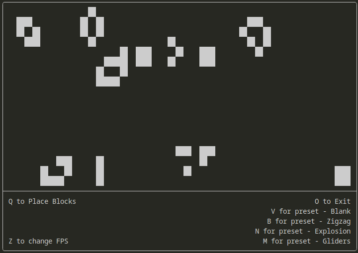

# Terminal Life

A simple and small terminal recreation of Conway's Game of Life, made because why not?

Features:
* Switchable FPS
* Pause and unpause, with separate modals for placing cells
* A handful of presets
* Runs in a terminal

Packages are minimal, so it shouldn't require anything that isn't built-in with python already.

